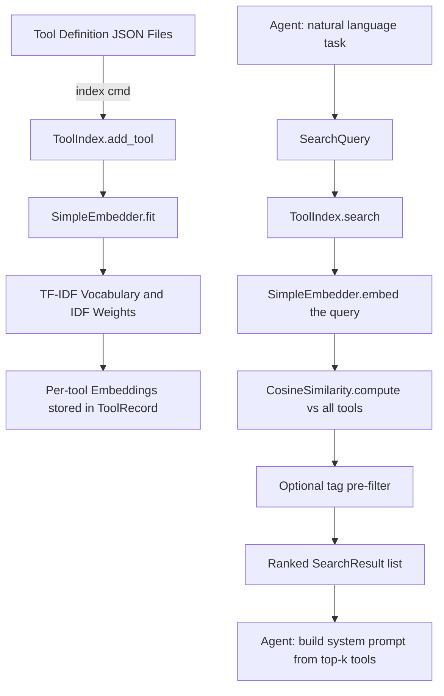

# aumai-toolretrieval

Vector-indexed semantic search over large tool registries. Give your AI agent a library of hundreds of tools and let it find the right ones instantly — without scanning every description on every request.

[](https://github.com/aumai/aumai-toolretrieval/actions)
[](https://pypi.org/project/aumai-toolretrieval/)
[](LICENSE)
[](https://python.org)

Part of the [AumAI](https://github.com/aumai) open-source agentic infrastructure suite.

---

## What is this?

Imagine you have a toolbox with 500 tools. When you need a screwdriver, you do not pick up each tool in turn, read its label, and put it back until you find the right one. Instead you know roughly where the screwdrivers live and walk straight to that drawer.

`aumai-toolretrieval` is that organisational system for AI agents. You register every tool your system exposes — each with a name, description, tags, and capability list — and then ask in plain English for the tool you need. The library returns a ranked shortlist in milliseconds using vector similarity. Your agent builds its next LLM prompt from those top matches instead of from the full 500-tool catalogue.

---

## Why does this matter?

### The problem: tool proliferation

Modern agentic systems accumulate tools rapidly — web search, email, database queries, file operations, API integrations, custom business logic. Each tool must be described to the LLM somewhere. At around 50+ tools, two problems compound:

1. **Cost** — every tool description consumes tokens on every LLM call, whether those tools are relevant to the current task or not.
2. **Accuracy** — research consistently shows that LLMs degrade in tool-selection quality when presented with more than roughly 20 candidates simultaneously.

### The first-principles solution

The agent does not need all tools all the time. It needs the tools that are relevant to this specific task. That is a **retrieval problem**, not a generation problem.

`aumai-toolretrieval` solves it with a TF-IDF bag-of-words embedder — no GPU, no API key, no external AI service required — and cosine similarity ranking. You ask "send a message to the user" and the index returns `send_email` ranked above `execute_sql`. You build your system prompt only from those top-k results.

---

## Architecture



**Key components:**

| Component | Role |
|---|---|
| `ToolRecord` | Pydantic model holding tool metadata plus its embedding vector |
| `SimpleEmbedder` | Builds a TF-IDF vocabulary from the corpus; encodes text as unit-normalised vectors |
| `CosineSimilarity` | Numpy-backed dot-product similarity between two float vectors |
| `ToolIndex` | Central registry: stores tools, builds the index, dispatches search and tag queries |
| `SearchQuery` | Validated input: query text, optional tag filter, top-k count |
| `SearchResult` | Output: matched tool record, cosine score, 1-based rank |

---

## Features

- **Zero external AI dependencies** — no OpenAI key, no sentence-transformers, no GPU required.
- **TF-IDF embeddings** — smooth IDF weighting down-ranks common words and up-ranks discriminative terms unique to specific tools.
- **Tag-based pre-filtering** — narrow the candidate set before similarity scoring for both speed and precision.
- **Incremental indexing** — call `add_tool()` at any time; rebuild with a single `build_index()` call.
- **Persistent CLI state** — `index` and `search` commands persist state to `~/.aumai/toolretrieval/index.json` automatically.
- **Dual output formats** — human-readable text and machine-readable JSON for pipeline integration.
- **Pydantic v2 models** — all inputs and outputs are validated at the boundary; no silent type coercions.
- **Minimal dependencies** — only `numpy`, `pydantic`, and `click`.

---

## Quick Start

### Install

```bash
pip install aumai-toolretrieval
```

### Your first search in under 5 minutes

**Step 1 — Create tool definition files.**

```bash
mkdir my-tools

cat > my-tools/search.json <<'EOF'
{
  "tool_id": "web_search",
  "name": "Web Search",
  "description": "Search the internet for current information on any topic",
  "tags": ["search", "web", "retrieval"],
  "capabilities": ["keyword search", "news lookup", "fact checking"]
}
EOF

cat > my-tools/email.json <<'EOF'
{
  "tool_id": "send_email",
  "name": "Send Email",
  "description": "Compose and send an email to one or more recipients",
  "tags": ["communication", "email", "messaging"],
  "capabilities": ["send message", "attach files", "cc and bcc"]
}
EOF

cat > my-tools/db.json <<'EOF'
{
  "tool_id": "execute_sql",
  "name": "Database Query",
  "description": "Run parameterised SQL queries against a relational database",
  "tags": ["database", "sql", "data"],
  "capabilities": ["select", "insert", "update", "aggregate"]
}
EOF
```

**Step 2 — Build the index.**

```bash
aumai-toolretrieval index --tools-dir my-tools
# Indexed 3 tool(s) from my-tools.
```

**Step 3 — Search.**

```bash
aumai-toolretrieval search --query "I need to find information online"
#   [1] Web Search (score=0.6842)
#       Search the internet for current information on any topic
#   [2] Database Query (score=0.1203)
#       Run parameterised SQL queries against a relational database

aumai-toolretrieval search --query "notify the user by email" --output-format json
```

---

## CLI Reference

### `aumai-toolretrieval index`

Build or update the tool index from a directory of JSON definition files. Each JSON file must deserialise as a valid `ToolRecord`.

```
Usage: aumai-toolretrieval index [OPTIONS]

Options:
  --tools-dir PATH   Directory containing tool definition JSON files.  [required]
  --help             Show this message and exit.
```

Tool definition file format:

```json
{
  "tool_id": "globally-unique-id",
  "name": "Human-Readable Name",
  "description": "What the tool does in plain English",
  "tags": ["tag1", "tag2"],
  "capabilities": ["capability one", "capability two"]
}
```

**Example:**

```bash
aumai-toolretrieval index --tools-dir ./tools
# Indexed 42 tool(s) from ./tools.
```

Malformed files are skipped with a warning; valid files in the same directory are still indexed.

---

### `aumai-toolretrieval search`

Search the index with a natural-language query.

```
Usage: aumai-toolretrieval search [OPTIONS]

Options:
  --query TEXT                  Natural-language search query.  [required]
  --top-k INTEGER               Maximum number of results to return.  [default: 5]
  --tag TEXT                    Filter to tools with this tag. Repeatable.
  --output-format [text|json]   Output format.  [default: text]
  --help                        Show this message and exit.
```

**Examples:**

```bash
# Plain text output, top 3 results
aumai-toolretrieval search --query "run a database query" --top-k 3

# JSON output for pipeline use
aumai-toolretrieval search --query "send a notification" --output-format json

# Tag filter: only consider tools tagged 'communication'
aumai-toolretrieval search --query "reach the user" --tag communication

# Multiple tag filters (OR logic — any matching tag qualifies)
aumai-toolretrieval search --query "find files" --tag storage --tag filesystem
```

JSON output schema:

```json
[
  {
    "rank": 1,
    "tool_id": "send_email",
    "name": "Send Email",
    "score": 0.7412,
    "description": "Compose and send an email to one or more recipients"
  }
]
```

---

## Python API Examples

### Basic index and search

```python
from aumai_toolretrieval import ToolIndex, ToolRecord, SearchQuery

index = ToolIndex()

index.add_tool(ToolRecord(
    tool_id="web_search",
    name="Web Search",
    description="Search the internet for current information",
    tags=["search", "web"],
    capabilities=["keyword search", "news lookup"],
))
index.add_tool(ToolRecord(
    tool_id="send_email",
    name="Send Email",
    description="Compose and send email messages to recipients",
    tags=["communication", "email"],
    capabilities=["send message", "attach files"],
))

# Must call build_index() after adding tools
index.build_index()

results = index.search(SearchQuery(query_text="notify the user", top_k=3))
for result in results:
    print(f"[{result.rank}] {result.tool.name}  score={result.score:.4f}")
```

### Tag-filtered search

```python
from aumai_toolretrieval import SearchQuery

results = index.search(SearchQuery(
    query_text="find information",
    tags_filter=["search", "retrieval"],
    top_k=5,
))
```

### Retrieve a specific tool by ID

```python
tool = index.get_tool("web_search")
if tool is not None:
    print(tool.name, tool.description)
```

### Tag-based lookup without scoring

```python
communication_tools = index.search_by_tags(["communication", "messaging"])
for tool in communication_tools:
    print(tool.tool_id, tool.name)
```

### Inspect all registered tools

```python
all_tools = index.get_all_tools()
print(f"Registry contains {len(all_tools)} tools")
```

### Use the embedder and similarity scorer directly

```python
from aumai_toolretrieval import SimpleEmbedder, CosineSimilarity

embedder = SimpleEmbedder()
embedder.fit(["search the web", "send an email", "query a database"])

vec_a = embedder.embed("search online for news")
vec_b = embedder.embed("look up information on the web")

score = CosineSimilarity.compute(vec_a, vec_b)
print(f"Similarity: {score:.4f}")
```

---

## Configuration

The CLI stores its index at `~/.aumai/toolretrieval/index.json`. This is a plain JSON array of `ToolRecord` objects (with embeddings) and can be inspected, backed up, or edited directly.

| Path | Purpose |
|---|---|
| `~/.aumai/toolretrieval/index.json` | Persisted tool registry (created automatically on first `index` run) |

No environment variables or additional configuration files are required.

---

## How it works — technical deep-dive

### TF-IDF embedding

`SimpleEmbedder` implements smooth TF-IDF:

1. **Tokenisation** — lower-case text split on non-alphanumeric boundaries: `re.findall(r"[a-z0-9]+", text.lower())`.
2. **IDF computation** — for term `t` with document frequency `df` across `N` documents: `IDF(t) = log((N+1)/(df+1)) + 1`. The additive smoothing prevents zero-division on tiny corpora.
3. **TF computation** — within a document, each term's weight is `count(term) / total_tokens`.
4. **TF-IDF weighting** — element-wise `TF * IDF`.
5. **L2 normalisation** — the vector is divided by its Euclidean magnitude so all vectors lie on the unit hypersphere. This makes cosine similarity equivalent to a simple dot product.

### Tool document construction

Each `ToolRecord` is collapsed into a single text document before embedding:

```
{name} {description} {tag1} {tag2} ... {capability1} {capability2} ...
```

This ensures the embedder sees all searchable signal from each tool as a single vector.

### Search pipeline

1. Encode `query_text` with the fitted embedder.
2. If `tags_filter` is set, reduce candidates to tools sharing at least one tag (case-insensitive intersection).
3. Compute cosine similarity between the query vector and each candidate's stored embedding.
4. Sort descending by score; slice to `top_k`.
5. Wrap each result in a `SearchResult` with rank, score, and the full `ToolRecord`.

### Vocabulary staleness

The embedder vocabulary is fixed after `fit()`. Adding tools after `build_index()` without calling `build_index()` again means the new tools have no embedding and are excluded from scored results. Always call `build_index()` after a batch of additions. The CLI `index` command does this automatically.

---

## Integration with other AumAI projects

| Project | How it connects |
|---|---|
| `aumai-costprov` | After retrieving top-k tools, use `aumai-costprov` to estimate the token cost of the enriched prompt before sending it to the LLM. Block or warn if a budget limit is near. |
| `aumai-datasynthesizer` | Generate hundreds of synthetic `ToolRecord`-shaped JSON objects to populate a test registry and benchmark retrieval accuracy at scale. |
| `aumai-specs` | Store formal tool contract descriptions in `ToolRecord.description` for richer retrieval signals that reflect the tool's actual interface. |

---

## Contributing

Contributions are welcome. Please read `CONTRIBUTING.md`. In brief:

- Python 3.11+, strict mypy, ruff linting — run `make lint` before submitting.
- All public functions must have type hints and docstrings.
- Tests live in `tests/` and use pytest plus hypothesis for property-based cases.
- Feature branches from `main`: `feature/`, `fix/`, `docs/`.
- Squash-merge PRs; commit messages explain why, not what.

---

## License

Apache 2.0. See [LICENSE](LICENSE).

---

Part of [AumAI](https://github.com/aumai) — open-source infrastructure for the agentic AI era.
